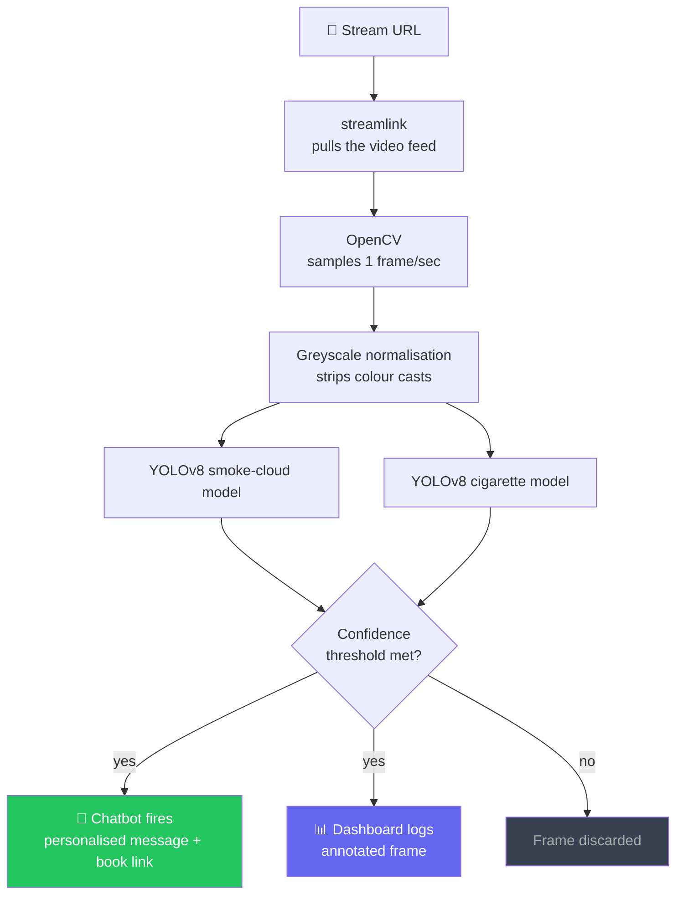

# Smick


---

My roommate Jude quit smoking after reading *Easy Way to Quit Smoking*. So did I. I thought that was the end of the story.

Then I noticed something: every time a streamer lit a cigarette on camera, the craving came back. Not because I wanted to smoke — but because watching someone do it live, casually, mid-conversation, makes it look completely normal. I wasn't alone. Millions of people watch Kick and Twitch every day, and a lot of them are in the same fragile place I was.

So I started reaching out to streamers who smoke on stream. I asked them to pin a message in their chat — my story, and a link to the book that changed things for me. No judgment, just a quiet nudge at the exact moment a viewer might be reaching for their own cigarette.

**Five people have told me they quit because of those pinned messages.**

I want to reach 1,000 by the end of the year.

---

## The problem

Doing this by hand doesn't scale. I'd have to watch hundreds of hours of footage to catch the right moments. So I built Smick: a lightweight computer-vision system that monitors livestreams in real time, detects the exact moment someone smokes on camera, and fires a chatbot message — along with the book — right when viewers are most psychologically open to it.

I run it on a Hetzner VPS for about **$50/month**, monitoring 10 streamers at a time.

---

## How it works



> **Key insight:** On a red-neon-lit frame, a cigarette scored **0.04 confidence** in colour and **0.74 in greyscale**. Shape matters more than colour when detecting smoke. Stripping colour before inference was the single biggest improvement.

---

## Detection in action

| Frame condition | Colour inference | Greyscale inference |
|----------------|-----------------|-------------------|
| Normal lighting | ✅ Works well | ✅ Works well |
| Red / neon light | ❌ 0.04 conf — missed | ✅ 0.74 conf — caught |
| Blue stage light | ❌ Often missed | ✅ Reliable |
| Dark room | ⚠️ Inconsistent | ✅ Reliable |

Two models run on every frame in parallel:

| Model | File | Speciality |
|-------|------|-----------|
| kittendev YOLOv8m | `best.pt` | Smoke clouds (99.5% mAP50) |
| cadilak YOLOv8n | `cigarette.pt` | Cigarette · Vape · Smoke objects |

---

## Progress

```
People reached    ████░░░░░░░░░░░░░░░░  5 / 1,000
Streamers live    ████████████████████  10 / 10
Monthly cost      $50 / month (Hetzner VPS)
```

---

## Running it yourself

### Requirements

- Python 3.10+
- Node.js 20+ and pnpm

### Install

```bash
git clone https://github.com/tmoula/Switch.git
cd Switch

# Python — CPU-only torch, no GPU needed
pip install --no-cache-dir torch torchvision \
  --index-url https://download.pytorch.org/whl/cpu
pip install ultralytics streamlink opencv-python-headless

# Node
pnpm install
```

### Models

Download these into `smokewatch/models/`:

| File | Source |
|------|--------|
| `best.pt` | [kittendev on Roboflow](https://universe.roboflow.com/kittendev/smoke-detection-xmh7j) |
| `cigarette.pt` | [cadilak on Roboflow](https://universe.roboflow.com/cadilak/cigarette-detection) |

### Start

```bash
# Terminal 1 — API server
pnpm --filter @workspace/api-server run dev

# Terminal 2 — Web dashboard
pnpm --filter @workspace/smokewatch-ui run dev
```

Open the dashboard, paste a VOD or live stream URL, set your confidence threshold, and hit **Start Detection**.

### Environment

| Variable | Default | Purpose |
|----------|---------|---------|
| `PORT` | `8080` | API server port |
| `WEBHOOK_URL` | — | Where to POST detection events |
| `DRY_RUN` | `true` | Set `false` to actually fire the chatbot |

---

## Chatbot payload

When a detection fires, the chatbot receives:

```json
{
  "streamer": "username",
  "confidence": 0.74,
  "labels": ["Cigarette(cigarette.pt)", "smoke(best.pt)"],
  "timestamp": "2026-05-22T01:08:52Z",
  "frameNumber": 47
}
```

---

## Roadmap

- [ ] Twitch live stream support
- [ ] Auto-generated personalised messages per streamer
- [ ] Persistent log with clip export for outreach proof
- [ ] Discord bot out of the box
- [ ] Browser extension that overlays detection on Kick/Twitch pages
- [ ] Fine-tuned model on real streamer footage

---

## Contributing

If you have a VOD clip Smick misses, open an issue with the timestamp. That's the fastest way to improve it.

If you've quit smoking and want to share your story with streamers, reach out. That's really what this is about.

---

## License

MIT
